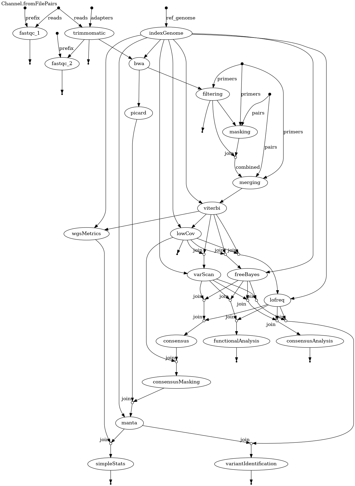

NextFlow pipeline for SARS-CoV-2 Illumina data
==============================================

This pipeline is reimplementation of [pzh_pipeline_sars_illumina](https://github.com/michallaz/pzh_pipeline_sars_illumina) in NextFlow.
I has also integrated SV module from [pzh_pipeline_sars_illumina_SV](https://github.com/michallaz/pzh_pipeline_sars_illumina_SV).

### Pipeline visualisation



### Installation and usage

1. Install NextFlow

```bash
  curl -s https://get.nextflow.io | bash
  mv nextflow ~/bin
```

2. Build two containers:

```bash
  docker build --target production -f Dockerfile-main -t nf_illumina_sars-3.0 .
  docker build --target prodcution -f Dockerfile-manta -t nf_illumina_sars-3.0-manta .
```

3. Copy `run_nf_pipeline.sh.template` to `run_nf_pipeline.sh` and fill in the paths to the reads and output directory.
4. Run the pipeline:

```bash
  ./run_nf_pipeline.sh
```